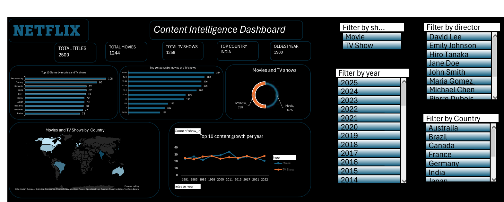

# Netflix Content Intelligence Dashboard

An interactive Excel dashboard analyzing Netflix's content library — exploring genre trends, ratings, country distribution, and content growth over time.

## Overview

This dashboard provides a high-level intelligence view of Netflix's catalog, allowing users to filter and explore titles by type, release year, director, and country using interactive slicers.

**Key metrics:**
- Total Titles: 2,500
- Total Movies: 1,244
- Total TV Shows: 1,256
- Top Content Country: India
- Oldest Release Year: 1980

## Key Insights

- **Movie vs TV Show split:** Fairly balanced catalog, with TV Shows at 51% and Movies at 49%.
- **Top genres:** Documentary and Comedy lead, followed by Crime, Sci-Fi, and Action.
- **Top ratings:** TV-PG, TV-G, and TV-14 are the most common content ratings.
- **Content growth:** Steady increases in title releases from the 1980s through the early 2020s, with Movies and TV Shows tracked separately over time.
- **Global reach:** Content spans multiple countries, with strong representation from India, the US, and other major markets.

## Tools Used

- **Microsoft Excel** – dashboard design, PivotTables, PivotCharts
- **Slicers** – interactive filtering by type, year, director, and country
- **Formulas** – summary metrics and calculated fields

## Features

- Filter by content type (Movie / TV Show)
- Filter by release year, director, and country
- Map visualization of content distribution
- Trend line chart for content growth per year
- Genre and ratings breakdown by top 10

## Files in This Repo

- `netflix_dashboard.xlsx` – Excel source file (with PivotTables and dashboard)
- `netflix_titles.csv` – dataset used
- `dashboard_screenshot.png` – exported view of the dashboard

## How to View

1. Download `netflix_dashboard.xlsx`
2. Open with Microsoft Excel
3. Use the slicers to explore the interactive filters and visuals

---
*Part of my data analytics portfolio as I transition from mechanical engineering into data analytics.*
